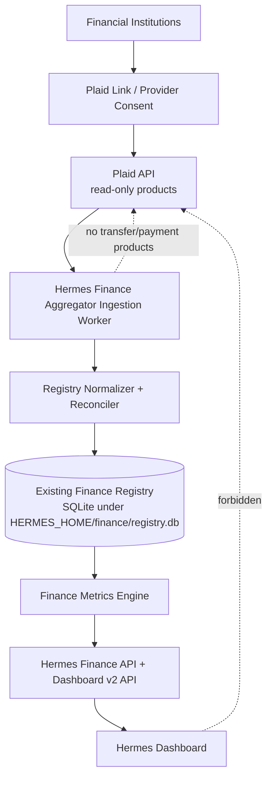
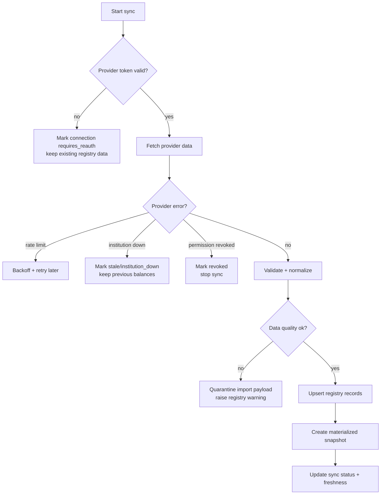

# Finance Integration Architecture

Objective: integrate a read-only financial aggregation source into the existing Hermes Finance Registry while preserving the registry as the single source of truth for all financial reporting, analytics, and dashboard metrics.

Recommended provider: Plaid.

## Non-negotiable constraints

- Read-only access only.
- No money movement.
- No bill payment.
- No transfer capability.
- No credential storage outside approved provider workflows.
- Dashboard must never query aggregator APIs directly.
- Existing Finance Registry remains canonical.

## Target architecture

## Target data flow

1. User initiates provider connection through a Hermes finance setup action.
2. Backend creates a provider `link_token` for read-only products only.
3. User completes Plaid Link or equivalent provider consent flow.
4. Backend exchanges the provider `public_token` for a provider `access_token`.
5. Token is stored only in approved secure storage/encrypted registry metadata.
6. Ingestion worker reads provider data:
   - Accounts
   - Balances
   - Transactions
   - Investments
   - Liabilities
   - Income / recurring deposits where available
   - Recurring transactions/bills where available
7. Normalizer maps provider records to the Finance Registry canonical schema.
8. Reconciler deduplicates, upserts, and creates materialized snapshot rows.
9. Finance metrics engine reads only the registry and derives dashboard metrics.
10. Dashboard consumes only Hermes APIs backed by the registry.

## Component design

### 1. Provider connection layer

Responsibilities:

- Create read-only link sessions.
- Request only approved products/scopes.
- Record institution, item, account-selection, and consent state.
- Never collect bank credentials in Hermes UI or CLI.
- Never enable Plaid Transfer, Payment Initiation, or similar money movement products.

Recommended allowed Plaid products/scopes:

- `transactions`
- `auth` only if needed for account/routing metadata; do not use for transfers
- `investments`
- `liabilities`
- `income` only if needed and approved
- `assets` not recommended for this phase unless reports are explicitly required
- `balance` only if real-time balance is needed

Explicitly disallowed:

- Transfer
- Payment Initiation
- Signal for payment risk unless future approved use case exists
- Processor token creation for payment processors
- Any endpoint that initiates, authorizes, or facilitates money movement

### 2. Ingestion worker

Responsibilities:

- Pull data on a schedule and on-demand.
- Handle webhooks where available.
- Convert provider-specific payloads into canonical registry records.
- Track import run state.
- Fail safely without deleting existing registry truth.

Proposed module shape:

- `hermes_cli/finance_providers/base.py`
- `hermes_cli/finance_providers/plaid.py`
- `hermes_cli/finance_ingestion.py`
- `hermes_cli/finance_reconciliation.py`
- `hermes_cli/finance_registry.py` extended with normalized tables/accessors

### 3. Finance Registry

The existing SQLite registry stays at:

`<get_hermes_home()>/finance/registry.db`

`finance_snapshots` remains the dashboard rollup table during migration. New normalized tables should be added beside it.

### 4. Metrics engine

Metrics engine must calculate:

- Net worth
- Cash position
- Debt position
- Monthly burn
- Monthly income
- Savings rate
- Fund progress
- Debt payoff progress
- Portfolio value
- Asset allocation
- Dividend income where investment transaction data supports it

Inputs: normalized registry tables only.

Outputs: same or extended finance command center contract consumed by `/api/dashboard/v2`.

## Sync frequency

| Data type | Default cadence | Rationale |
|---|---|---|
| Accounts/institution metadata | Daily and on link/update webhook | Low-change metadata |
| Transactions | Every 6 hours plus provider webhooks if available | Good freshness for spending/bills without excessive API calls |
| Balances cached | Every 6 hours | Enough for dashboard cash/net-worth trends |
| Real-time balances | Manual/on-demand only | Avoid cost/latency; only needed for current cash checks |
| Investments/holdings | Daily | Market values usually sufficient daily for dashboard |
| Liabilities/debt | Daily | Debt/loan balances do not require high-frequency polling |
| Income/recurring deposits | Daily after transaction sync | Derived from transactions/income streams |
| Materialized finance snapshot | After every successful ingestion run and once daily at minimum | Stable trend series |

Recommended first implementation: manual/on-demand sync plus daily scheduled sync. Add webhooks after base ingestion is stable.

## Failure handling

Failure rules:

- Never delete historical registry records because a provider sync fails.
- Keep last-known-good values with freshness metadata.
- Mark stale accounts visibly in diagnostics.
- Token/consent failures require user reauthorization through provider flow.
- Partial failures must be isolated per item/account; one broken account should not block all other accounts.
- Store raw provider payload hashes/import references for audit, but avoid putting sensitive raw payload dumps in dashboard responses.

## Security considerations

### Credential and token handling

- Hermes must not handle financial institution usernames/passwords.
- Provider Link/Connect flow handles credentials and MFA.
- Store provider access tokens encrypted at rest or in approved secret storage.
- Never commit tokens to repo, docs, logs, or Obsidian.
- Redact token-like fields from logs.
- Use least-privilege products/scopes.
- Provide a disconnect/revoke operation that marks the connection disabled and, if supported, revokes provider access.

### API boundary

- Finance setup/write endpoints should require authenticated dashboard session/admin authorization.
- Aggregator API keys belong in environment/credential storage, not config docs.
- Dashboard responses should expose source freshness and status, not provider tokens or raw account numbers.
- Account numbers, routing numbers, and institution credentials should not be stored unless explicitly required and approved.

### Money movement prevention

Implementation safeguards:

- Provider client module exposes only read methods.
- No SDK/client wrapper for transfer/payment endpoints.
- Add tests that forbidden endpoint names/products are absent from configuration and code paths.
- Use separate provider app credentials configured for read-only products where provider supports product gating.
- Document allowed and forbidden products in config.

## Reconciliation logic

### Identity keys

Use stable canonical keys:

- Connection: provider + provider item id
- Account: provider + provider account id
- Transaction: provider + provider transaction id
- Holding: provider + account id + security id
- Liability: provider + account id + liability type
- Snapshot: import run id + captured_at

### Upsert rules

- Accounts: upsert by provider account id; preserve internal id.
- Transactions: upsert by provider transaction id; if pending transaction becomes posted, link via provider pending id when available.
- Balances: insert time-series balance records; also update current account balance summary.
- Holdings: replace account holding set per successful holdings sync; keep historical valuation snapshots.
- Liabilities: upsert per liability account; append balance/payment snapshots.
- Recurring bills: derive from recurring transaction streams; link to transactions; allow manual override fields.

### Registry vs aggregator truth

- Aggregator is an input source, not the system of record.
- Registry stores normalized, reconciled, timestamped records.
- Manual overrides/annotations live in the registry and must not be overwritten by provider sync unless the field is provider-owned.
- Dashboard metrics use registry-owned records and source freshness metadata.

## Observability

Add a `finance_import_runs` table and dashboard diagnostics fields:

- `last_successful_sync_at`
- `last_attempted_sync_at`
- `provider_status`
- `stale_account_count`
- `requires_reauth_count`
- `latest_import_run_id`
- `warnings`
- `data_quality_score`

## Tests required

- Provider client cannot call transfer/payment endpoints.
- Dashboard does not import or call provider client.
- Aggregator ingestion writes normalized registry records.
- Metrics engine reads registry tables, not provider APIs.
- Failed sync preserves last-known-good dashboard metrics with stale status.
- Duplicate transaction import is idempotent.
- Pending-to-posted transaction reconciliation works.
- Revoked token marks connection disabled and stops sync.
