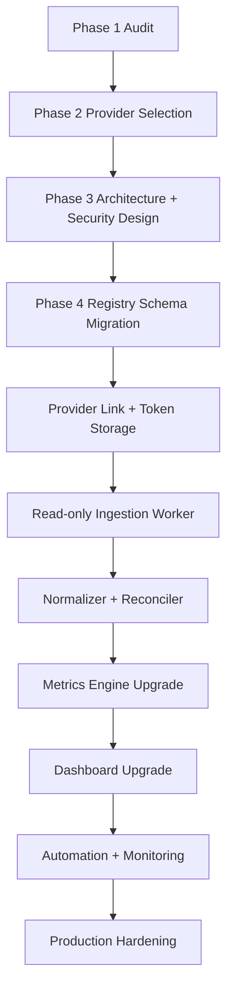

# Finance Registry Integration Master Plan

Objective: integrate read-only financial aggregation into the existing Hermes Finance Registry and establish the registry as the single source of truth for all financial reporting, analytics, and dashboard metrics.

Recommended provider: Plaid.
Fallback provider if Plaid pricing/onboarding is unacceptable: Teller.

## Success criteria

- Existing Finance Registry remains source of truth.
- Dashboard never depends directly on aggregator APIs.
- All financial data is normalized into the registry.
- System remains read-only.
- Financial reporting becomes automated and reliable.
- Architecture supports future expansion.

## Current baseline

- Existing registry: `/home/yuu/.hermes/profiles/engineering_lab/finance/registry.db`
- Current storage: SQLite table `finance_snapshots`
- Current data: 3 snapshot rows, latest row is default-seed quality
- Current dashboard: `/api/dashboard/v2` -> `financial_metrics` -> `ReportsPage.tsx` Finance Command Center
- Current APIs:
  - `GET /api/finance`
  - `GET /api/finance/widgets`
  - `GET /api/finance/trends/{metric}`
  - `POST /api/finance/snapshots`
  - `POST /api/finance/seed-defaults`
- Current automations: no Hermes cron jobs found at audit time

## Workstream overview

## Phase 1 — Registry audit

Status: complete in documentation.

Deliverable:

- `docs/finance_registry_audit.md`

Key findings:

- Registry exists and is SQLite-backed.
- Dashboard already consumes registry-backed finance contract.
- Data is seed/default quality, not verified financial truth.
- Normalized tables for accounts, transactions, liabilities, investments, and import runs are missing.

## Phase 2 — Aggregator research

Status: complete in documentation.

Deliverable:

- `docs/financial_aggregator_comparison.md`

Decision:

- Use Plaid first.
- Use Teller as fallback for local/personal cost simplicity.

## Phase 3 — Integration architecture

Status: complete in documentation.

Deliverable:

- `docs/finance_integration_architecture.md`

Architecture rule:

`Financial Institutions -> Plaid -> Finance Registry -> Hermes Dashboard`

## Phase 4 — Registry mapping and schema migration

Deliverable:

- `docs/finance_registry_mapping_plan.md`

Tasks:

1. Add migration function in `hermes_cli/finance_registry.py` or new migration module.
2. Create tables:
   - `finance_provider_connections`
   - `finance_accounts`
   - `finance_account_balances`
   - `finance_transactions`
   - `finance_recurring_items`
   - `finance_liabilities`
   - `finance_investment_holdings`
   - `finance_investment_transactions`
   - `finance_import_runs`
3. Preserve `finance_snapshots` for dashboard rollups.
4. Add source/provenance fields to snapshot payloads.
5. Add tests for schema creation and idempotent migrations.

Dependencies:

- Audit confirmation.
- Provider decision.

Estimated effort: 1-2 engineering days.

Risks:

- Breaking existing dashboard contract.
- Migration conflicts with existing seed rows.

Mitigation:

- Add tables only; keep current columns and API contract unchanged.

## Phase 5 — Provider integration foundation

Tasks:

1. Add provider abstraction:
   - `FinanceProvider` interface with read-only methods.
   - `PlaidFinanceProvider` implementation.
2. Add configuration/env validation for provider credentials.
3. Implement Link token creation endpoint.
4. Implement public-token exchange endpoint.
5. Store provider connection metadata and encrypted token reference.
6. Add disconnect/revoke/disable endpoint.
7. Add tests proving no money movement products/endpoints are exposed.

Dependencies:

- Registry migration tables.
- Plaid app credentials and approved read-only products.

Estimated effort: 2-4 engineering days.

Risks:

- Token storage security.
- Accidentally enabling money movement products.
- Dashboard authentication/authorization gaps.

Mitigation:

- Use environment/secret storage.
- Hardcode allowed read-only product allowlist.
- Add security tests for forbidden products.

## Phase 6 — Read-only ingestion worker

Tasks:

1. Implement account sync.
2. Implement balance sync.
3. Implement transaction sync with cursor/incremental support where provider supports it.
4. Implement liabilities sync.
5. Implement investments sync.
6. Implement recurring transaction/income derivation.
7. Insert import run records.
8. Make sync idempotent.
9. Add dry-run mode.
10. Add retry/backoff and partial failure handling.

Dependencies:

- Provider integration foundation.
- Registry mapping tables.

Estimated effort: 4-7 engineering days.

Risks:

- Provider data variability.
- Duplicate/pending transactions.
- Institution downtime and reauth flows.

Mitigation:

- Upsert by provider ids.
- Preserve last-known-good data.
- Track stale/requires_reauth statuses.

## Phase 7 — Reconciliation and metrics engine

Tasks:

1. Implement canonical account classification.
2. Implement transaction category normalization.
3. Implement recurring bills and income detection.
4. Implement net worth/cash/debt/investment calculations from normalized tables.
5. Materialize finance snapshot after successful sync.
6. Add freshness and verification status fields.
7. Preserve existing widget labels and API contract.

Dependencies:

- Ingestion writes normalized records.

Estimated effort: 3-5 engineering days.

Risks:

- Incorrect metric calculations.
- Misclassified internal transfers as income/expense.
- Seed data mixed with provider data.

Mitigation:

- Add fixture-driven tests for common finance cases.
- Add transfer exclusion logic.
- Mark source/provenance per metric and snapshot.

## Phase 8 — Dashboard modernization

Deliverable:

- `docs/finance_dashboard_upgrade_plan.md`

Tasks:

1. Extend `/api/dashboard/v2.financial_metrics` with executive finance, funds, debt, income, investments, diagnostics.
2. Update `ReportsPage.tsx` Finance Command Center with upgraded sections.
3. Add freshness/source badges.
4. Add diagnostics drawer.
5. Ensure no frontend provider API dependency.
6. Add frontend tests.

Dependencies:

- Metrics engine emits new sections.

Estimated effort: 2-4 engineering days.

Risks:

- UI exposing backend setup details on executive surface.
- Dashboard treating stale/seed values as verified truth.

Mitigation:

- Use executive-friendly badges and diagnostics drawer.
- Keep raw source diagnostics out of primary executive cards.

## Phase 9 — Automation and operations

Tasks:

1. Add sync command, e.g. `hermes finance sync` or internal script.
2. Add optional scheduled job for daily sync once user approves schedule.
3. Add webhook endpoint support if provider webhooks are enabled.
4. Add logs/metrics for import runs.
5. Add alert/report when sync requires reauth.

Dependencies:

- Stable ingestion worker.

Estimated effort: 1-3 engineering days.

Risks:

- Background sync without visibility.
- Excessive provider API calls.

Mitigation:

- Start with manual sync.
- Add daily cadence after validation.
- Add rate limits/backoff.

## Recommended execution order

1. Confirm Plaid account/access and allowed read-only products.
2. Implement registry migrations only.
3. Implement provider abstraction and secure token/connection storage.
4. Implement Plaid Link setup endpoints.
5. Implement account/balance ingestion first.
6. Implement transaction ingestion and idempotent reconciliation.
7. Add materialized snapshot generation from normalized data.
8. Implement liabilities and investments.
9. Implement recurring bills/income derivation.
10. Upgrade dashboard API and UI.
11. Add automation and monitoring.
12. Run full test suite and dashboard smoke verification.

## Acceptance tests

### Registry/source tests

- Existing seed registry still loads.
- New migrations are idempotent.
- Existing dashboard finance widgets still render after migration.
- Aggregator records upsert without duplicate transactions.
- Provider sync failures preserve existing registry rows.

### Security tests

- No transfer/payment products configured.
- Provider access token never appears in API responses/log output.
- Dashboard frontend imports no provider client.
- Disconnect disables future sync.

### Dashboard tests

- `/api/dashboard/v2.financial_metrics.source.type == finance_registry`.
- Dashboard displays registry freshness.
- Seed/manual/provider-synced statuses are distinct.
- Finance metrics are generated from normalized registry tables.

### Operational tests

- Manual sync writes an import run.
- Failed provider auth marks connection `requires_reauth`.
- Institution-down error marks connection stale without deleting values.
- Scheduled sync is idempotent.

## Risks and mitigations

| Risk | Impact | Mitigation |
|---|---|---|
| Plaid pricing/onboarding unsuitable | Blocks Plaid production | Use Teller fallback |
| Sensitive token leakage | Critical | Encrypted storage, redaction, no token in responses/logs |
| Accidental money movement | Critical | Product allowlist, no transfer client, tests |
| Dashboard bypasses registry | High | Architecture tests and import boundaries |
| Provider outages/stale data | Medium | Last-known-good values + freshness diagnostics |
| Duplicate transactions | Medium | Provider id unique constraints and pending reconciliation |
| Misclassified transfers | Medium | Transfer detection and manual override |
| Seed data mistaken for true data | Medium | `snapshot_source` and visible freshness/verification |

## Estimated total effort

- Documentation/audit/research: complete.
- Registry migrations: 1-2 days.
- Provider setup + secure connection flow: 2-4 days.
- Ingestion/reconciliation: 4-7 days.
- Metrics/dashboard modernization: 4-7 days.
- Automation/hardening/tests: 3-5 days.

Total: approximately 14-25 engineering days depending on provider access, desired UI polish, and test depth.

## Final implementation principle

Do not make the aggregator the finance system. The aggregator is a read-only feed. The Finance Registry is the system of record. The dashboard is a consumer of registry-derived metrics only.
